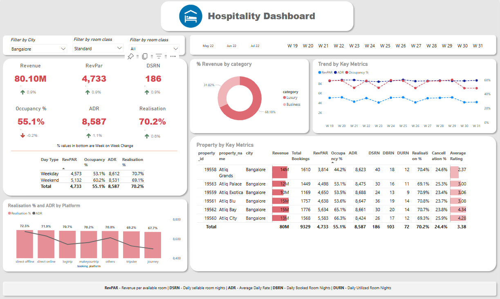

# Revenue Insights in Hospitality Domain

## Table of Contents

- [Introduction](#introduction)
- [Features](#features)
- [Usage](#usage)
- [Contribution](#contribution)

## Introduction

The Revenue Insights in Hospitality Domain dashboard is a powerful tool designed for hospitality professionals to analyze and optimize revenue strategies. It provides comprehensive insights into revenue performance, enabling data-driven decisions for hotels, restaurants, and other businesses in the hospitality industry.

## Features

- Analyze revenue data for room bookings
- Visualize revenue trends and performance metrics.
- Forecast future revenue and occupancy rates.
- Generate customized reports for stakeholders.
- Intuitive and user-friendly interface for easy navigation.

## Usage

The dashboard is designed for hospitality professionals to monitor and optimize revenue strategies. Use it to analyze revenue data, set pricing strategies, and make data-driven decisions to maximize profitability.

## contribution
We welcome contributions to the Revenue Insights Dashboard project. If you have suggestions, feature requests, or want to report issues, please open an issue or submit a pull request. Review our Contributing Guidelines for more information.

